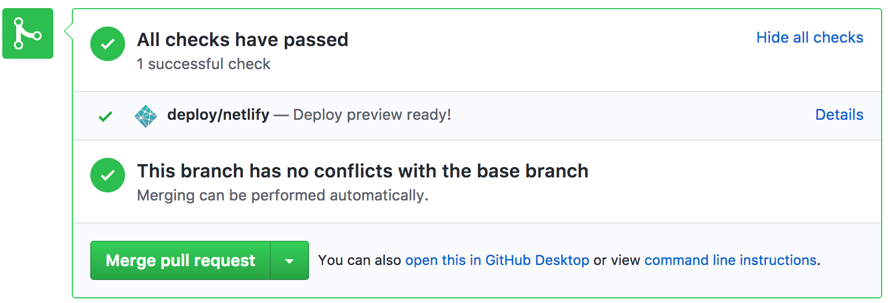

# [cehscoding.club](https://cehscoding.club)

# How to make a blog post

1. Navigate to [the cehscoding `_posts` folder on GitHub](https://github.com/nrobinson2000/cehscoding/tree/master/_posts)

2. Click the <kbd>Create new File</kbd> button.  (You will have to log into GitHub if you have not done so already.)

3. Name the file in the following format:

```
yyyy-mm-dd-LastName.md
```

4. Place the following in the top of the file:

```
---
layout: post
title: "FirstName Update dd-mm-yy"
date: "yyyy-mm-dd HH:MM:SS -0500"
---
```

Substitute in the title, dates, and time in the formats above.

5. Enter the content for your post below the `---`. You must write your post using [Markdown formatting.](https://daringfireball.net/projects/markdown/basics)  I recommend using [Dillinger](http://dillinger.io/) to draft your post.

6. Once you have finished your post, click the green <kbd>Propose new File</kbd> button at the bottom.  On the next page, click the green <kbd>Create pull request</kbd> button.

7. Change the title of your pull request and add a comment if you wish.  Click the green <kbd>Create pull request</kbd> button when you are ready.

8. Wait for me to merge your pull request.  A preview of the blog with your added post will automatically be generated and you can view it by clicking the `Show all checks` link and clicking `Details` on `deploy/netlify`.

<center></center>
